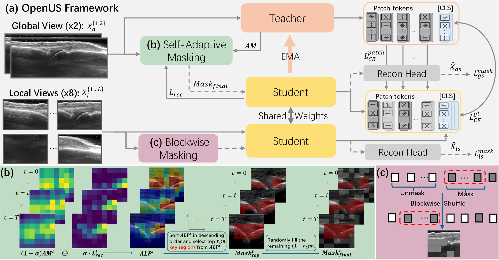

# OpenUS
OpenUS: A Fully Open-Source Foundation Model for Ultrasound Image Analysis via Self-Adaptive Masked Contrastive Learning

Pre-train a general-purpose ultrasound representation with our recipe, then fine‑tune or evaluate on classification, segmentation, landmark localization, LVEF regression, image enhancement, and fetal cardiac detection tasks.

---

## Overview

This repository contains the code for our paper:  
 
[[Paper on arXiv](https://www.arxiv.org/abs/2511.11510)]



- **Foundation pre-training** for ultrasound images using self‑adaptive masked contrastive learning.
- **Plug‑and‑play backbones** (e.g., `vmamba_small`) with optional pretrained V‑Mamba weights.
- **Ready‑to‑use evaluation** for **classification** (e.g., *Fetal Planes*, *BUSI*), **segmentation** (e.g., *TN3K*, *BUSBRA*), and four additional downstream tasks from the US-DINO pipeline.


## Installation

**Requirements**

- Python **3.10**
- PyTorch **2.2** with CUDA 12.x (recommended)
- Linux or WSL2 (Windows)
- Optional: a Weights & Biases account for logging

```bash
conda create -n openus python=3.10 -y
conda activate openus

pip install torch==2.2 torchvision torchaudio triton pytest chardet yacs termcolor fvcore seaborn packaging ninja einops numpy==1.24.4 timm==0.4.12

# Optional V‑Mamba dependency if you plan to use vmamba_small
pip install https://github.com/state-spaces/mamba/releases/download/v2.2.4/mamba_ssm-2.2.4+cu12torch2.2cxx11abiTRUE-cp310-cp310-linux_x86_64.whl

# Extra downstream-task utilities
pip install pyiqa clean-fid pandas openpyxl scikit-image
```

---

## Dataset Preparation

This copy contains the CUSTOM segmentation training and evaluation pipeline.

### Evaluation datasets

| Task | Dataset | Example Arg(s) |
|---|---|---|
| Segmentation | `TN3K` | `--dataset_name TN3K --data_root <ROOT> --data_root2 <ALT_ROOT> --json_file <META.json>` |
| Segmentation | `BUSBRA` | `--dataset_name BUSBRA --data_root <ROOT> --json_file <META.json>` |

> **Tip**: Keep a consistent directory structure and use absolute paths for reproducibility.

---

## Downstream Tasks

### 1) Segmentation

Supported example datasets: **`TN3K`** and **`BUSBRA`**.

```bash
python eval_segmentation.py   
  --arch vmamba_small   
  --dataset_name TN3K                 # or 'BUSBRA'
  --data_root <DATA_ROOT>   
  --data_root2 <OPTIONAL_SECOND_ROOT>   
  --json_file <METADATA_JSON>   
  --pretrained_vmamba True   
  --pretrained_weights <CKPT_PATH>   
  --output_dir <OUTPUT_DIR>   
  --log_name <RUN_NAME>   
  --lr 0.001
```

## Fine-tune in your custom dataset

### 1) Segmentation

```bash
python eval_segmentation.py   
  --arch vmamba_small   
  --dataset_name <Custom Dataset>                  
  --data_root <DATA_ROOT>   
  --data_root2 <OPTIONAL_SECOND_ROOT>   
  --json_file <METADATA_JSON>   
  --pretrained_vmamba True   
  --pretrained_weights <Pre-trained_OpenUS_CKPT_PATH>   
  --output_dir <OUTPUT_DIR>   
  --log_name <RUN_NAME>   
  --lr <.>
```

Mon dataset : 

 python3 eval_segmentation.py \
    --arch vmamba_small --dataset_name CUSTOM --multilabel True \
    --coco_json data/_annotations.coco.json \
    --images_root data/images --split_file data/splits.json \
    --pretrained_vmamba True \
    --pretrained_weights checkpoint/openus_cpt0150.pth \
    --checkpoint_key teacher --num_classes 3 \
    --epochs 100 --lr 0.001 \
    --batch_size_per_gpu 4 --num_workers 4 \
    --output_dir output/custom_seg_new --log_name custom_seg

python3 test_segmentation.py \
      --arch vmamba_small \
      --dataset_name CUSTOM \
      --multilabel True \
      --coco_json data/_annotations.coco.json \
      --images_root data/images \
      --split_file data/splits.json \
      --pretrained_vmamba True \
      --pretrained_weights checkpoint/openus_cpt0150.pth \
      --checkpoint_key teacher \
      --num_classes 3 \
      --output_dir output/custom_seg_new \
      --cpk_name best \
      --batch_size_per_gpu 4 \
      --num_workers 4 \
      --save_predictions True \
      --save_masks True \
      --save_overlays True
---

### Cross-validation CUSTOM en 5 folds

Depuis `OpenUS`, avec l’environnement Python OpenUS activé :

```bash
python3 run_cross_validation.py --dry-run
python3 run_cross_validation.py
# Après une interruption :
python3 run_cross_validation.py --resume
```

Le lanceur réunit train + validation et répartit les poissons en cinq groupes
(graine 42). Toutes les images d’un poisson restent ensemble. Le test source
est conservé identique et indépendant. Chaque fold entraîne un nouveau décodeur
avec le backbone gelé, sélectionne le meilleur Dice de validation, exporte les
prédictions de validation out-of-fold, puis évalue le test indépendant.

Les valeurs par défaut reprennent la commande CUSTOM ci-dessus : 100 époques,
lr 0.001, batch 4, 4 workers, images 512, teacher, initialisation VMamba activée.
Les scripts enfants utilisent le même interpréteur Python que le lanceur.
Les chemins relatifs sont résolus depuis `OpenUS`.

Options : `--epochs`, `--lr`, `--batch_size_per_gpu`, `--num_workers`,
`--img_size`, `--val_freq`, `--seed`, `--checkpoint_key`, `--pretrained_weights`,
`--split_file`, `--coco_json`, `--images_root`, `--output_dir`. Les options
`--no-save_predictions`, `--no-save_masks`, `--no-save_overlays` désactivent les
exports de test correspondants ; les TXT out-of-fold restent obligatoires.
`--no-pretrained_vmamba` désactive l’initialisation VMamba ; par défaut son poids
est attendu dans `pretrained/vmamba/vssm_small_0229_ckpt_epoch_222.pth`.

Sorties dans `output/custom_seg_cv5` :

- `splits/` : cinq JSON train/val/test et manifeste avec empreintes des données.
- `fold_N/attempt_M/` : checkpoints, métriques et journaux d’entraînement/test.
- `fold_N/attempt_M/eval/predicted_masks_teacher/pred_<image>.txt` : prédictions
  out-of-fold, un fichier par image, vide si aucun polygone n’est prédit. Format
  existant : classe 0=Cavite, 1=Gonade, 2=Intestin, puis coordonnées normalisées
  des contours externes à la taille originale. Ce format ne représente pas les
  trous internes. Les folds couvrent une fois toutes les images train + val.
- `summary.json` et `summary.csv` : résultats des cinq folds ; le JSON contient
  également moyennes non pondérées et écarts-types d’échantillon (ddof=1),
  avec validation et test séparés et ordre des classes explicite.

La validation conserve son agrégation existante par batch ; le test calcule
les scores par image. Les prédictions out-of-fold utilisent des poids qui n’ont
pas été entraînés sur ces images, mais ces images participent au choix de
l’époque par validation. Le test indépendant reste la mesure finale réservée.
Les scores du test ne servent pas à choisir le fold ; aucun ensemble de modèles
ni réentraînement final n’est effectué.

Le lanceur refuse un dossier existant sans `--resume`. La reprise vérifie les
paramètres et empreintes des données/checkpoint, ignore les folds terminés et
reprend l’export de validation ou le test si l’entraînement était terminé. Un
entraînement interrompu recommence dans une nouvelle tentative ; ses anciens
fichiers sont conservés. Une commande échouée ou un résultat manquant arrête
l’exécution. Le dry-run n’écrit rien et ne lance aucun entraînement.


NOUVELLE COMMANDE :
/home/ldepiero/Stage-GonAIde-2026/Debut/OpenUS-multiclass/OpenUs_venv/bin/python \
    run_cross_validation.py --resume